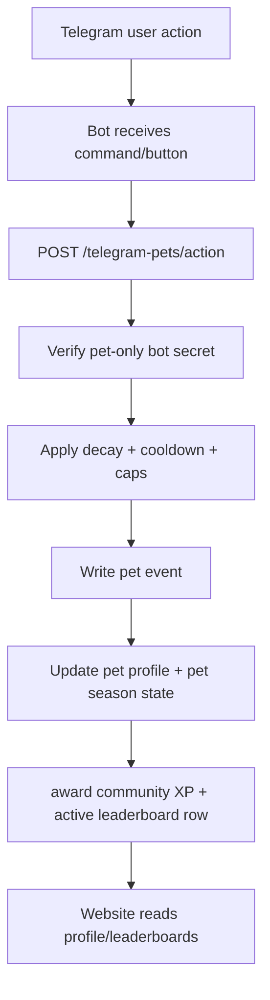

# Crypto Moonboys Pets Telegram Roguelite Plan

## Mission

Crypto Moonboys Pets is a Telegram-first 24/7 roguelite pet game where users grow a living Moonboys companion through daily care, missions, seasons, streaks, and long-term progression.

The Telegram game must feed the existing Crypto Moonboys website XP system as another official game source, alongside the arcade. The website remains the public scoreboard, profile, quest, season, and activity surface. Telegram remains the play surface.

## Non-Negotiables

- The game is about users growing their Crypto Moonboys pets, not a generic Tamagotchi clone.
- XP must sync into the existing `telegram_users.xp`, `telegram_xp_log`, and `telegram_leaderboard` model.
- Website XP must be server-authoritative. Do not trust client-side or bot-side claims without server validation.
- Telegram identity must stay the account key. Use the same Telegram-linked model already used by community XP and arcade sync.
- Seasons must continue forever without manual resets.
- The game must support daily, weekly, seasonal, and all-time progression.
- Gameplay must be lightweight enough for Telegram but deep enough to run for years.
- The bot should not create a separate leaderboard universe. It should create a new official XP source inside the existing community XP economy.

## Current Site Systems To Reuse

Existing production patterns already present in the repo:

- `workers/moonboys-api/worker.js`
  - `awardXp(db, telegramId, xpChange, action, referenceId)`
  - active-season `telegram_leaderboard` writes used by `/telegram/leaderboard`
  - Telegram auth verification
  - `/telegram/profile`
  - `/telegram/leaderboard`
  - `/telegram/quests`
  - `/telegram/season/current`
  - `/telegram/activity`
  - arcade progression sync patterns
- `workers/moonboys-api/schema.sql`
  - `telegram_users`
  - `telegram_xp_log`
  - `telegram_activity_log`
  - `telegram_leaderboard`
  - `telegram_seasons`
  - `telegram_quests`
  - `telegram_quest_completions`
  - `arcade_progression_state`
  - `arcade_progression_events`
- `js/telegram-community.js`
  - website community XP leaderboard widgets
  - quest panel
  - profile card
  - daily status
  - activity feed
- `docs/arcade-xp-sync-path.md`
  - server-authoritative XP sync model
  - dedupe and anti-farm expectations
- `docs/roguelite-xp-loop-contract.md`
  - canonical arcade loop and sync rules

## Recommended Architecture

### 1. Telegram Bot Runtime

The bot runs the actual pet game loop and exposes commands/buttons.

Core commands:

| Command | Purpose |
| --- | --- |
| `/pet` | Show pet status, stage, mood, stats, current missions, and next best action |
| `/adopt` | Create the user's first Crypto Moonboys pet |
| `/feed` | Reduce hunger and create a care event |
| `/play` | Increase happiness and create a care event |
| `/clean` | Improve cleanliness and create a care event |
| `/sleep` | Restore energy and create a care event |
| `/train` | Gain stronger pet XP but cost hunger/energy |
| `/mission` | Show active daily and weekly pet missions |
| `/season` | Show current pet season progress |
| `/petscore` | Show user pet XP and rank |
| `/gkleaderboard` | Reuse community leaderboard presentation |
| `/gklink` | Existing website link flow |

Use Telegram inline buttons for the main actions so mobile users are not forced to type every command.

### 2. Moonboys API Authority

Add a dedicated API namespace under `workers/moonboys-api/worker.js`:

| Route | Method | Purpose |
| --- | --- | --- |
| `/telegram-pets/state` | GET/POST | Read or mutate current pet state |
| `/telegram-pets/action` | POST | Submit one care/training/action event |
| `/telegram-pets/missions` | GET | Return active daily/weekly/seasonal pet missions |
| `/telegram-pets/leaderboard` | GET | Pet-specific leaderboard, backed by same Telegram identity |
| `/telegram-pets/season/current` | GET | Current pet season metadata |
| `/telegram-pets/admin/grant` | POST | Admin-only repair/grant endpoint, protected like existing admin routes |

The bot should call these routes instead of directly editing D1 from a separate service. That keeps validation, XP caps, seasons, audit logs, and future website widgets in one place.

### 3. D1 Tables

Add a migration, for example:

`workers/moonboys-api/migrations/0XX_telegram_pets.sql`

Required tables:

```sql
CREATE TABLE IF NOT EXISTS telegram_pet_profiles (
  telegram_id TEXT PRIMARY KEY,
  pet_name TEXT NOT NULL DEFAULT 'Moonpet',
  species TEXT NOT NULL DEFAULT 'moonbeast',
  stage TEXT NOT NULL DEFAULT 'egg',
  pet_xp INTEGER NOT NULL DEFAULT 0,
  level INTEGER NOT NULL DEFAULT 1,
  hunger INTEGER NOT NULL DEFAULT 25,
  happiness INTEGER NOT NULL DEFAULT 70,
  cleanliness INTEGER NOT NULL DEFAULT 70,
  energy INTEGER NOT NULL DEFAULT 70,
  health INTEGER NOT NULL DEFAULT 75,
  streak_days INTEGER NOT NULL DEFAULT 0,
  last_active_day TEXT,
  last_decay_at DATETIME NOT NULL DEFAULT CURRENT_TIMESTAMP,
  created_at DATETIME NOT NULL DEFAULT CURRENT_TIMESTAMP,
  updated_at DATETIME NOT NULL DEFAULT CURRENT_TIMESTAMP,
  FOREIGN KEY (telegram_id) REFERENCES telegram_users(telegram_id) ON DELETE CASCADE
);

CREATE TABLE IF NOT EXISTS telegram_pet_events (
  id TEXT PRIMARY KEY,
  telegram_id TEXT NOT NULL,
  event_type TEXT NOT NULL,
  event_key TEXT NOT NULL,
  xp_awarded INTEGER NOT NULL DEFAULT 0,
  pet_xp_awarded INTEGER NOT NULL DEFAULT 0,
  season_key TEXT NOT NULL,
  day_key TEXT NOT NULL,
  metadata TEXT,
  created_at DATETIME NOT NULL DEFAULT CURRENT_TIMESTAMP,
  UNIQUE(telegram_id, event_key),
  FOREIGN KEY (telegram_id) REFERENCES telegram_users(telegram_id) ON DELETE CASCADE
);

CREATE TABLE IF NOT EXISTS telegram_pet_season_state (
  telegram_id TEXT NOT NULL,
  season_key TEXT NOT NULL,
  season_xp INTEGER NOT NULL DEFAULT 0,
  weekly_xp INTEGER NOT NULL DEFAULT 0,
  daily_xp INTEGER NOT NULL DEFAULT 0,
  daily_key TEXT NOT NULL DEFAULT '',
  weekly_key TEXT NOT NULL DEFAULT '',
  updated_at DATETIME NOT NULL DEFAULT CURRENT_TIMESTAMP,
  PRIMARY KEY (telegram_id, season_key),
  FOREIGN KEY (telegram_id) REFERENCES telegram_users(telegram_id) ON DELETE CASCADE
);

CREATE TABLE IF NOT EXISTS telegram_pet_mission_completions (
  telegram_id TEXT NOT NULL,
  mission_key TEXT NOT NULL,
  window_key TEXT NOT NULL,
  xp_awarded INTEGER NOT NULL DEFAULT 0,
  completed_at DATETIME NOT NULL DEFAULT CURRENT_TIMESTAMP,
  PRIMARY KEY (telegram_id, mission_key, window_key),
  FOREIGN KEY (telegram_id) REFERENCES telegram_users(telegram_id) ON DELETE CASCADE
);
```

Do not replace the existing `telegram_quests` table. Pet missions can be generated server-side from deterministic keys and optionally mirrored into `telegram_quests` for website display.

### 4. XP Model

There are two XP layers:

| XP Type | Purpose |
| --- | --- |
| Pet XP | Grows the pet stage, unlocks traits, drives pet-only rank |
| Community XP | Feeds the existing website XP leaderboard and user level |

Recommended awards:

| Action | Pet XP | Community XP | Notes |
| --- | ---: | ---: | --- |
| Feed | 6 | 2 | Cooldown protected |
| Clean | 6 | 2 | Cooldown protected |
| Play | 10 | 3 | Costs energy/hunger |
| Sleep | 5 | 1 | Rest action, lower reward |
| Train | 20 | 6 | Higher reward, higher cost |
| Daily care set | 30 | 15 | Complete feed/play/clean once in a day |
| Weekly streak 5/7 | 100 | 50 | Strong retention loop |
| Seasonal boss/milestone | 250+ | 100+ | Event reward, capped |

Call existing `awardXp(...)` only after the pet action passes validation.

Important: `awardXp(...)` alone is not enough for seasonal leaderboard visibility. The pet XP award path must also upsert the active-season row in `telegram_leaderboard` when an active `telegram_seasons` row exists, or update `/telegram/leaderboard` so it aggregates seasonal XP from `telegram_xp_log` including `pet_%` actions. Preferred implementation: add a shared helper such as `awardCommunityXp(...)` that performs both writes atomically:

1. insert `telegram_xp_log`
2. update `telegram_users.xp` and `telegram_users.level`
3. upsert `telegram_leaderboard(telegram_id, season_id, xp)` for the active season

Use action names such as:

- `pet_feed`
- `pet_play`
- `pet_clean`
- `pet_sleep`
- `pet_train`
- `pet_daily_mission_complete`
- `pet_weekly_mission_complete`
- `pet_season_milestone`

Use stable `reference_id` values:

- `pet:feed:2026-07-17:telegram_id`
- `pet:daily-care:2026-07-17:telegram_id`
- `pet:season-12:milestone-3:telegram_id`

This makes XP audit logs readable and dedupable.

### 5. Anti-Farm Rules

Telegram games are easy to spam, so protect it at the API level.

Minimum rules:

- Per-action cooldowns, stored server-side.
- Daily Community XP cap for pet game, separate from arcade cap.
- Pet XP cap per action family.
- Dedupe by `event_key`.
- Ignore duplicate Telegram callback queries.
- Reject impossible stat changes.
- Reject direct website/client writes to pet XP.
- Rate-limit by Telegram ID and IP where the existing Worker rate limit helper supports it.

Recommended caps:

| Window | Cap |
| --- | ---: |
| Pet Community XP per day | 250 |
| Pet XP per day | 1200 |
| Train actions per day | 20 |
| Care actions per hour | 40 total |
| Mission Community XP per day | 100 |

### 6. Infinite Seasons

Season generation must be automatic.

Use UTC windows:

- Daily reset: every UTC day
- Weekly reset: ISO week or Monday UTC
- Season reset: every 90 days
- Yearly reset: Jan 1 UTC

Season key format:

- `pet-sYYYY-NNN`, example `pet-s2026-003`

Do not manually seed every future season. Add helper functions:

- `getPetDayKey(now)` -> `YYYY-MM-DD`
- `getPetWeekKey(now)` -> `YYYY-Www`
- `getPetSeasonKey(now)` -> deterministic 90-day season key
- `getPetSeasonBounds(now)` -> start/end timestamps

When a user plays after a season turns over, the API creates/updates their new `telegram_pet_season_state` row automatically.

### 7. Roguelite Loop With Legs

The game needs more than feeding bars. Use a loop that can expand forever:

1. Care loop: keep pet alive and healthy.
2. Growth loop: pet stage and traits unlock from pet XP.
3. Mission loop: daily/weekly/seasonal tasks.
4. Adventure loop: send pet on timed Telegram adventures.
5. Risk loop: adventures can return boosts, scars, lore items, or temporary stat pressure.
6. Collection loop: cosmetic badges, titles, seasonal memories.
7. Community loop: pet XP contributes to website profile and faction pressure.
8. Seasonal loop: every 90 days adds new mission names, boss events, and modifiers.

Example daily missions:

- Feed your Moonpet once.
- Train once while energy is above 50.
- Finish a full care set: feed, clean, play.
- Return after 6+ hours and recover the pet.
- Help another player through a Telegram group action later.

Example weekly missions:

- Keep a 5-day streak.
- Train 15 times without health dropping below 40.
- Complete 20 care actions.
- Reach a new growth stage.

Example seasonal missions:

- Reach pet level 20.
- Complete 45 daily missions.
- Beat the seasonal pet boss event.
- Earn a seasonal pet title.

### 8. Website Integration

Add a new website panel without disrupting the existing arcade leaderboard.

Recommended surfaces:

- `community.html`
  - Add a `Crypto Moonboys Pets` panel.
  - Show pet stage, level, health, streak, season XP.
  - Show link prompt if no Telegram identity.
- `games/index.html`
  - Add a card for `Crypto Moonboys Pets` with CTA: `Play on Telegram`.
  - Mark it as `Telegram Game` rather than browser arcade.
- `js/telegram-community.js`
  - Fetch `/telegram-pets/state` for the current linked user.
  - Fetch `/telegram-pets/leaderboard?period=seasonal` for pet rankings.
  - Keep existing `/telegram/leaderboard` as total Community XP.

Website display rule:

- Community leaderboard = all Community XP sources.
- Pet leaderboard = pet-specific seasonal XP.
- Profile card = include pet summary, but do not replace normal Telegram profile.

### 9. Bot To Website Sync Flow



### 10. Security Model

Do not expose a public endpoint that lets anyone grant pet XP by posting a Telegram ID.

Use a pet-only bot secret for bot-to-API writes.

Required approach:

1. Add a dedicated secret such as `TELEGRAM_PETS_BOT_SECRET`.
2. The bot sends that secret in a pet-specific header such as `X-Pets-Bot-Secret`.
3. Only `/telegram-pets/*` write routes may honor this secret.
4. Existing global admin helpers such as `X-Admin-Secret` must not be accepted for normal pet gameplay actions.
5. The pet secret must not authorize unrelated admin, grant, link-token, anti-cheat, or maintenance routes.

Do not give the Telegram pet bot the site-wide `ADMIN_SECRET` or `X-Admin-Secret`. A leaked pet bot credential should only expose pet gameplay routes, not existing admin-secret routes.

Signed Telegram auth evidence can still be used for website reads or future user-submitted flows, but the core Telegram gameplay loop should use the pet-only bot secret because play happens inside Telegram.

The bot already receives trusted Telegram update payloads from Telegram. The bot should forward the Telegram user identity to the API with the pet-only bot secret. The API verifies the pet secret, then validates/caps the action.

### 11. Implementation Order

1. Add D1 migration for pet tables.
2. Add pet season/date helper functions to `workers/moonboys-api/worker.js` or a small route module.
3. Add a pet-only secret verifier for `X-Pets-Bot-Secret` that is scoped to `/telegram-pets/*` write routes only.
4. Add `/telegram-pets/state`, `/telegram-pets/action`, `/telegram-pets/missions`, and `/telegram-pets/leaderboard`.
5. Add a shared XP award helper that writes `telegram_xp_log`, `telegram_users`, and active-season `telegram_leaderboard` rows together for pet Community XP.
6. Add Telegram bot commands/buttons to call those API routes.
7. Add website pet panel to `community.html` and `js/telegram-community.js`.
8. Add a Telegram game card to `games/index.html`.
9. Add tests for dedupe, cooldown, daily caps, season rollover, leaderboard writes, pet-secret scoping, and website fetch fallback.
10. Update docs to state that Pets is a Telegram game source, not an arcade browser game.

### 12. Tests To Add

Suggested test files:

- `scripts/telegram-pets-api.test.mjs`
- `scripts/telegram-pets-season.test.mjs`
- `scripts/telegram-pets-community-panel.test.mjs`

Test cases:

- `/telegram-pets/action` rejects a missing pet bot secret.
- `/telegram-pets/action` rejects the global admin secret when the pet secret is absent.
- the pet bot secret does not authorize non-pet admin routes.
- duplicate `event_key` does not award XP twice.
- daily cap clamps Community XP.
- season key rolls over automatically.
- pet XP updates pet stage.
- pet Community XP writes `telegram_xp_log`, `telegram_users`, and the active `telegram_leaderboard` row.
- website panel shows empty state when Telegram is not linked.
- pet leaderboard is separate from total Community XP leaderboard.

### 13. PR Acceptance Criteria

The implementation PR is not done until:

- Telegram users can adopt a Crypto Moonboys pet.
- Pet actions persist in D1.
- Valid pet actions award Community XP through the shared XP helper.
- Pet Community XP writes `telegram_xp_log`, `telegram_users`, and active-season `telegram_leaderboard` rows, or `/telegram/leaderboard` is updated to aggregate from `telegram_xp_log`.
- `/telegram/leaderboard` includes pet-earned Community XP in active seasonal environments.
- Pet-specific leaderboard is available separately.
- Daily/weekly/seasonal mission state is visible from the API.
- Season rollover requires no manual intervention.
- Website has a pet panel and Telegram game CTA.
- Anti-spam/cooldown/dedupe tests pass.
- Existing arcade XP sync contract remains untouched.

## Short Codex Build Prompt

Use this when asking a coding agent to implement the next PR:

```text
Implement Crypto Moonboys Pets as a Telegram-first roguelite game source in Crypto-Moonboys/Crypto-Moonboys.github.io.

Follow docs/moonboys-pets-telegram-roguelite-plan.md exactly.

Add D1 pet tables, Moonboys API routes under /telegram-pets/*, a pet-only bot secret that never reuses ADMIN_SECRET, server-authoritative cooldown/dedupe/caps, automatic daily/weekly/90-day seasonal keys, Community XP awards that update telegram_xp_log, telegram_users, and active-season telegram_leaderboard rows, pet-specific leaderboard, website community pet panel, games/index.html Telegram game card, and tests for pet-secret scoping, auth, dedupe, caps, season rollover, leaderboard writes, and panel fallback.

Do not replace the existing arcade XP path. Pets must become another official XP source feeding telegram_users.xp, telegram_xp_log, and active-season telegram_leaderboard rows while keeping a separate pet-specific season leaderboard.
```